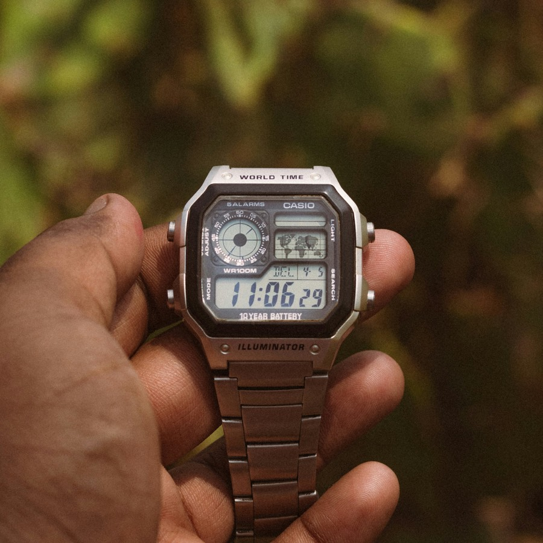
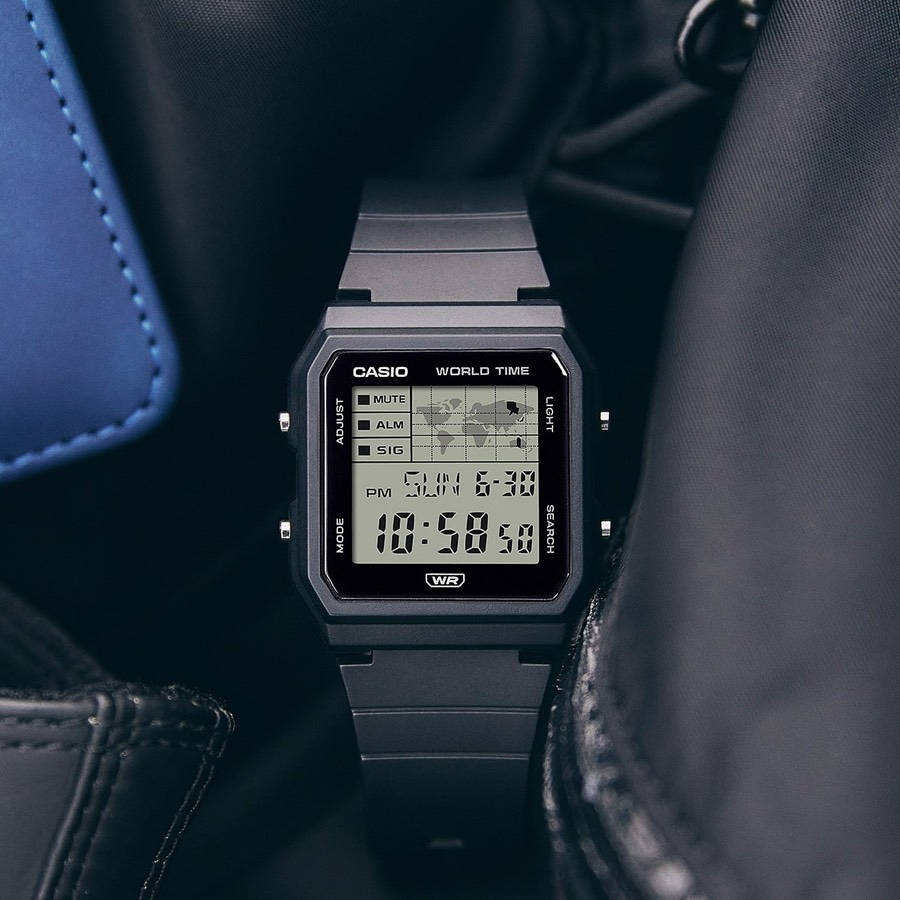

# Timan

World time in the terminal, inspired by the Casio AE-1200WH.

The AE-1200WH is the cheap digital watch with a tiny world map on its face: pick a
city and its band on the map lights up. Timan puts that watch in your terminal: a
green LCD, seven-segment digits, a world map, three-letter city codes, and a
per-city DST switch.


## From the watch to the terminal

<p align="center">
  
  
</p>
<p align="center">
  <sub>
    Left: Casio AE-1200WH (photo by <a href="https://unsplash.com/photos/wTlF2JXuepo">Dhilip Antony</a> on Unsplash).
    Right: Casio LF-30W (photo: Casio).
  </sub>
</p>

| On the AE-1200WH                           | In timan                                                        |
| ------------------------------------------ | --------------------------------------------------------------- |
| World map on the dial, city band lit       | Map panel, with the selected zone's band highlighted            |
| Home city + world time                     | **T0** is your system zone; **T1–T9** are your favorites       |
| Three-letter city codes (NYC, LON, TYO)    | Same codes on each favorite                                    |
| DST on/off per city                        | `d` cycles **auto → on → off** per favorite                    |
| 12/24-hour toggle                          | `t`                                                             |
| Green-tinted LCD, seven-segment digits     | Green-LCD theme, big segment digits, lit and unlit segments     |
| "WORLD TIME" printed above the display     | The same title above the digital clock                          |
| "10 YEAR BATTERY" printed below it         | Your real battery, in the same style: `87% · 4 HOUR BATTERY`    |

The battery line reads `pmset` on macOS and `/sys/class/power_supply` on Linux,
every 30 seconds. While charging it shows `87% BATTERY · CHARGING`; on a machine
without a battery it shows uptime instead (`12 DAY UPTIME`).

Where timan goes past the watch:

- Time zones are stored as IANA IDs, so DST changes on its own date, every year.
- Half- and quarter-hour offsets work (India +5:30, Nepal +5:45).
- The day marker (−1, 0, +1) compares calendar dates, not hours.
- An analog face sits next to the map.

## Install

**npm** (Node.js 18.3 or later):

```sh
npm install -g @israelfsilva/timan
```

**Homebrew** (macOS and Linux):

```sh
brew install israelfsilva/tap/timan
```

## Usage

```sh
timan              # world clock (TUI)
timan calibrate    # fix the analog face's proportions
timan --version
timan --help
```

When the output is piped, or the terminal is narrower than 60 columns, timan
prints a plain table:

```
T0  SAO PAULO  -03:00  local  9:11 PM  MON 28
T1  NEW YORK   -04:00    -1h  8:11 PM  MON 28
T2  LONDON     +01:00    +4h  1:11 AM  TUE 29  +1
T3  TOKYO      +09:00   +12h  9:11 AM  TUE 29  +1
T4  HONG KONG  +08:00   +11h  8:11 AM  TUE 29  +1
```

### Keys

| Key            | Action                                                    |
| -------------- | --------------------------------------------------------- |
| `↑` `↓`        | Move through the zone list (favorites, then the catalog) |
| `←` `→`        | Previous / next favorite                                 |
| `f`, `space`   | Add or remove the selected zone as a favorite            |
| `d`            | Cycle DST for a favorite: auto → on → off                |
| `z`            | Show or hide the zones panel                              |
| `m`            | Switch map ↔ analog face when both don't fit              |
| `t`            | 12 / 24-hour clock                                        |
| `q`, `Ctrl+C`  | Quit                                                      |

### Calibrating the analog face

Terminal cells aren't square, so the analog face can look stretched. Run
`timan calibrate`, press `+` / `−` until the dial is round, then `Enter` to save.
Many terminals report their cell size, so you may never need this.

## Configuration

Settings live in `~/.config/timan/config.json` (or `$XDG_CONFIG_HOME/timan/`),
created on first run. Favorites and DST are easiest to change in the TUI; to add
a zone that isn't in the catalog, edit the file:

```json
{
  "version": 1,
  "clock": "12h",
  "slots": [
    { "code": "NYC", "zone": "America/New_York", "dst": "auto" },
    { "code": "KTM", "zone": "Asia/Kathmandu", "name": "Kathmandu", "dst": "auto" }
  ],
  "ui": { "showZones": true }
}
```

Up to nine slots (T1–T9). T0 is always the system zone and isn't stored.

## License

MIT. Timan is a fan project and is not affiliated with or endorsed by Casio.
"Casio", "AE-1200WH" and "LF-30W" are trademarks of Casio Computer Co., Ltd.
